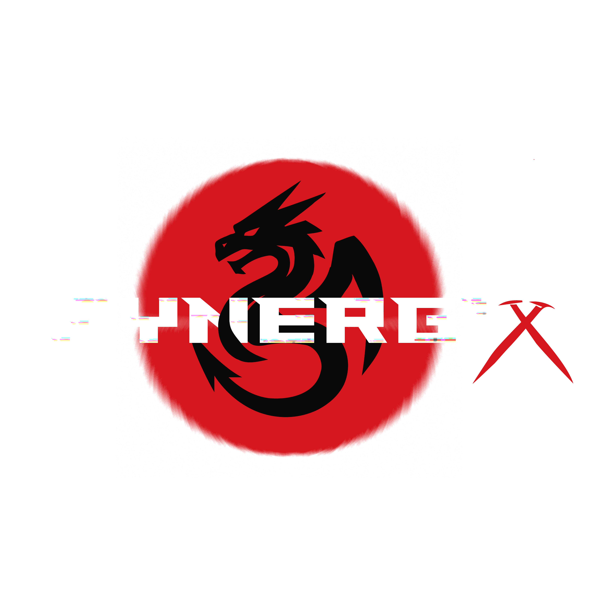

# Synergix Hackathon

<div align="center">
  
  
  [](https://reactjs.org/)
  [](https://www.typescriptlang.org/)
  [](https://tailwindcss.com/)
  [](https://vitejs.dev/)
  
  Where Innovation Meets Code
</div>

## 🚀 Overview

**Synergix** is an innovative hackathon platform designed to bring together brilliant minds from around the world to build revolutionary solutions in an intense 8-hour coding challenge. This modern React application showcases cutting-edge UI/UX with stunning animations, interactive components, and comprehensive hackathon management features.

## ✨ Features

- **Modern UI/UX Design**: Beautiful gradient backgrounds, glowing effects, and smooth animations
- **Responsive Layout**: Works seamlessly across all devices and screen sizes
- **Interactive Components**: Animated cards, accordions, and hover effects
- **Comprehensive Event Information**: Timeline, tracks, rewards, and team details
- **Engaging Visuals**: Video backgrounds, parallax effects, and dynamic content
- **Route Management**: Clean navigation with React Router
- **Performance Optimized**: Fast loading with efficient animations

## 🛠 Tech Stack

- **Frontend**: React, TypeScript, Vite
- **Styling**: Tailwind CSS, Framer Motion (animations)
- **UI Components**: Shadcn UI, Radix UI
- **Icons**: Lucide React
- **Routing**: React Router DOM
- **State Management**: React Query
- **Animations**: Framer Motion

## 📁 Project Structure

```
src/
├── components/          # Reusable UI components
│   ├── ui/             # Shadcn UI components
│   ├── About.tsx       # About section
│   ├── Hero.tsx        # Hero section with video background
│   ├── Timeline.tsx    # Event timeline
│   ├── Tracks.tsx      # Competition tracks
│   ├── Rewards.tsx     # Rewards section
│   ├── Team.tsx        # Team section
│   ├── FAQ.tsx         # Frequently asked questions
│   └── ...             # Other components
├── pages/              # Page components
│   ├── Index.tsx       # Main page
│   ├── Leaderboard.tsx # Leaderboard page
│   └── NotFound.tsx    # 404 page
├── hooks/              # Custom React hooks
├── lib/                # Utility functions
└── assets/             # Static assets
```

## 🚀 Getting Started

### Prerequisites

- Node.js (v16 or higher)
- npm or yarn

### Installation

1. Clone the repository:
```bash
git clone <repository-url>
```

2. Navigate to the project directory:
```bash
cd Synergix-Hack
```

3. Install dependencies:
```bash
npm install
```

4. Start the development server:
```bash
npm run dev
```

5. Open your browser and visit `http://localhost:5173`

### Available Scripts

- `npm run dev` - Start development server
- `npm run build` - Build for production
- `npm run preview` - Preview production build
- `npm run lint` - Lint the code

## 🎨 UI Components

The project uses a comprehensive set of UI components including:

- **Navigation**: Responsive navbar with mobile menu
- **Cards**: Animated cards with hover effects
- **Accordions**: FAQ section with collapsible items
- **Buttons**: Various styles with glowing effects
- **Forms**: Input fields and OTP components
- **Modals**: Dialogs and alerts
- **Animations**: Framer Motion powered transitions

## 📱 Responsive Design

The application is fully responsive and optimized for:

- Desktop: Full feature experience with advanced animations
- Tablet: Optimized layout with touch-friendly elements
- Mobile: Streamlined interface with hamburger menu

## 🔐 Contribution

** All Done by DeathSquat aka Nishchay Chaurasia **

## 📄 License

This project is licensed under the MIT License - see the [LICENSE](LICENSE) file for details.

## 🙏 Acknowledgments

- Built with React, TypeScript, and Tailwind CSS
- UI components from Shadcn UI
- Icons from Lucide React
- Animations powered by Framer Motion
- Special thanks to the entire Synergix team for organizing this amazing hackathon

---

<div align="center">

**Made with ❤️ by Nishchay Chaurasia**

</div>